<!--
  md_document:
    variant: markdown_github
    -->
Getting started with GitHub via RStudio
=======================================

Richard Layton
2015-08-29

Update R and RStudio
====================

If you don't have R and RStudio installed, start by installing R then RStudio, in that order.

-   [install R](https://www.r-project.org)
-   [install RStudio](https://www.rstudio.com/products/rstudio/)

If R and RStudio are installed, it's probably a good idea to update them.

-   [update R](http://www.r-statistics.com/2015/06/a-step-by-step-screenshots-tutorial-for-upgrading-r-on-windows/).
-   To update RStudio, open RStudio. In the *Help* pull-down menu, select *Check for updates*.

    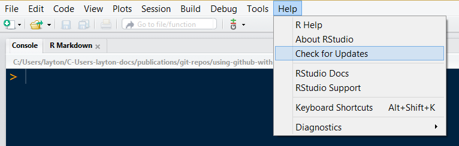

<!-- save this for after the .Renviron file is set
You should probably update your packages too. Open RStudio. Select the *Packages* tab and *Update*. Then *Select All* and *Install Updates*. 

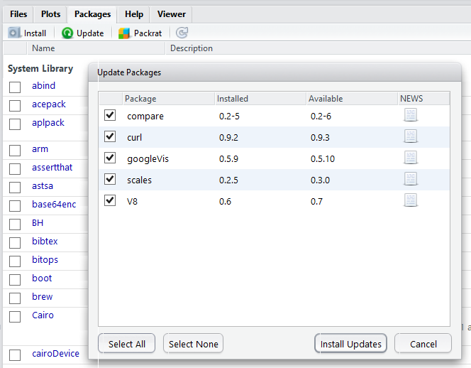
-->
GitHub
======

Go to <https://github.com> and sign up for an account.

Remember your GitHub user name and email address for the next step.

Git
===

Install Git using the appropriate method for your platform:

-   Windows or OS X: <http://git-scm.com/downloads>
-   Debian/Ubuntu: sudo apt-get install git-core
-   Fedora/RedHat: sudo yum install git-core

<!--Go to the Git program directory, find Git -> cmd -> git-gui.exe. On my Windows machine, I place a shortcut to this file on my desktop.-->
### Configure Git

Go to the Git program directory, find *git-bash.exe*. Run the file.

In the shell window that appears, type (but no quotes),

    git config --global user.name "your_github_user_name" 

and return/enter. On the new line, type

    git config --global user.email "your_github_email@somewhere"

and return/enter. Close the shell. We're done with Git.

### Set the RStudio option for Git

Open RStudio.

From the *Tools* pull-down menu, select *Global Options*, then *Git/SVN*. In the dialog box for *Git executable*, write the path to the file *git.exe* on your machine. For example, the path on my machine is `C:/Program Files/Git/bin/git.exe`.

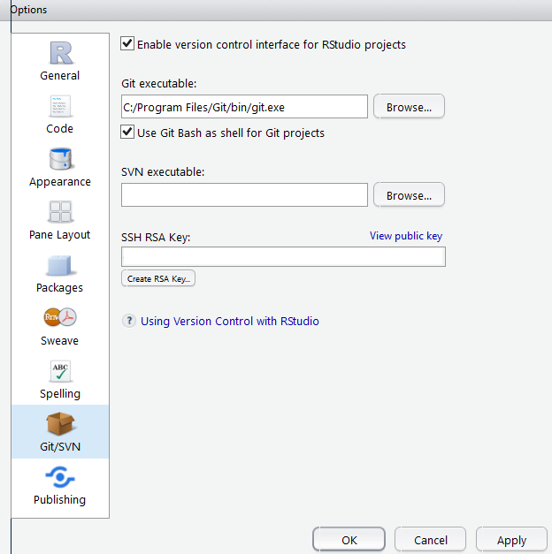

Connecting your local R project to GitHub
=========================================

There are several approaches to getting started with an R project and GitHub. I'm going to cover just two cases:

-   starting a new R project that includes a GitHub repository
-   creating a GitHub repository for an existing R project

In both cases, I begin by setting up a new repository ("repo") on GitHub.

### Create a repository on GitHub

Login to GitHub. Select the *Repositories* tab, then *New*.

Assign a name to the repository, short and memorable.

-   If this is a new project, use any convenient name, for example *test-project*. This name will also be used for the name of the project directory on your computer.

-   If you are creating a repository for an existing R project, use the name of that project directory or create a new (and possibly shorter) name---then on your computer change the name of the directory to match.

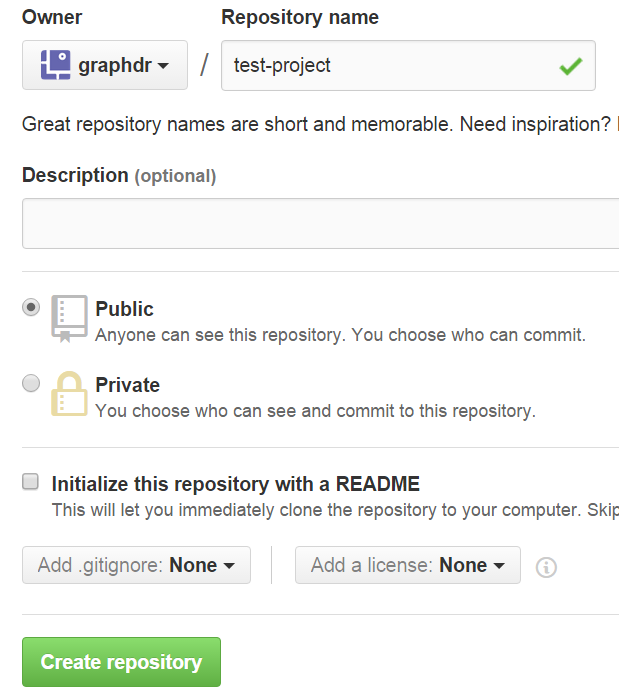

Then click *Create repository*. (You can ignore the initializing options for now.)

### Starting a new R project

In RStudio, in the *File* pull-down menu, select *New Project*, then *Version Control*, then *Git*.

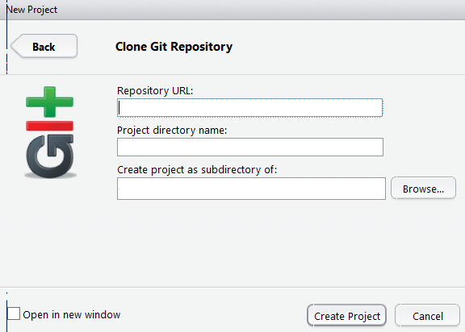

-   Return to your GitHub project repository and find the URL assigned by GitHub. There should be an `HTTPS` label and a URL something like: `https://github.com/your_user_name/test-project.git`. In the text box *Repository URL*, type or paste this URL.
-   The text box *Project directory name* should automatically populate with the project name, for example, *test-project*.
-   In the *Create project as a subdirectory of:* box, type the path or browse to the location for the new project folder.
-   *Create project*.

In the RSudio *Files* pane you should see two files in the new project directory, a *.gitignore* file and a *.Rproj* file.

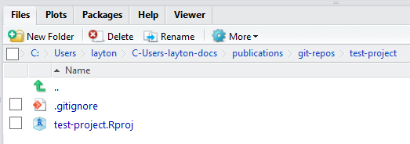

### Working with an existing R project

stuff

stuff

Create a .Renviron file
=======================

In RStudio, use *File*, *New File*, *Text File*. Type this one line in the file:

    R_LIBS_USER="C:/R/library"  

and *Save As* using the file name `.Renviron` in the top level of your project directory. This file sets a directory location for R packages that simplifies future R updates. (I recommend placing a copy of this file in the main directory of every RStudio project.)

README files
============

In RStudio, launch your test project (if it's not already open), e.g., *test-project.Rproj*.

Select *File*, *New File*, *R Markdown*, and *OK* for the default settings (we'll adjust them later).

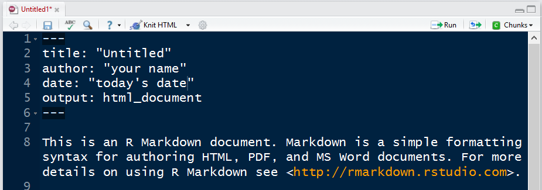

Save the untitled document as *README.Rmd* at the top level of the project directory.

Delete all the text in the Rmd file. Edit the YAML header and add one sentence as follows:

    ---
    output:
      md_document:
        variant: markdown_github
    ---

    Draft README file for GitHub. We will add more later. 

Save.

Press the *Knit* button.

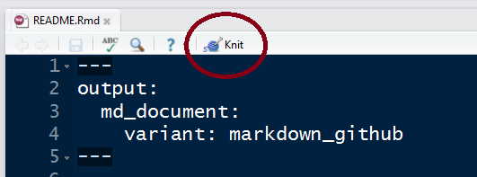

You can close the markdown window that appears.

Knitting this Rmd file produces the file *README.md*---this is the README file that we post to GitHub.

If all is well, the RStudio GUI should show a *Git* tab in the Environment pane. The *Files* tab should contain the *.Renviron*, *README.md*, and *README.Rmd* files.

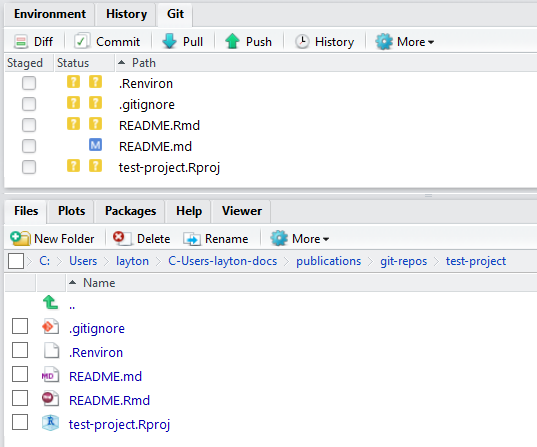

Commit files to GitHub
======================

In the RStudio Environment pane, select the *Git* tab.

Check the *.gitignore*, *README.md*, and the *filename.Rproj* files to commit to GitHub.

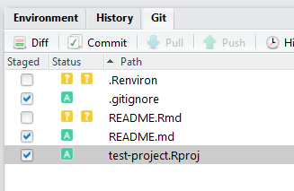

Click the *Commit* button.

In the dialog box that appears, type a commit message, e.g., "initial commit". In future commits, short and meaningful messages are useful for effective version control.

Click the *Commit* button. A message window appears. if there any any problems, read the message carefully. if everything is OK, close the window.

Press the *Push* icon. This "pushes" the files you committed to the GitHub repository. You can close the message window.

Go to you GitHub account. Select the *test-project* repository. You should find the three files you pushed. Ther text of the *README.md* file appears below the list of files.

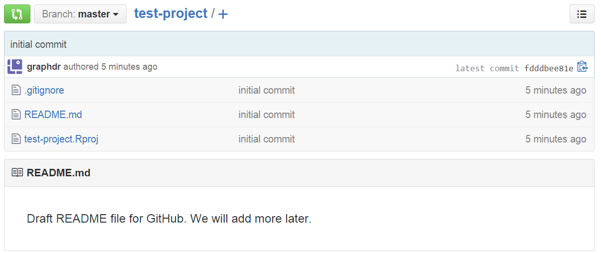

Editing a local file
====================

In RStudio, open the *README.Rmd* file. Add a new line

    Editing the README file. 

Save.

In the *Git* pane, check the "staged" box for the *README.md* file, commit, message, commit, and push as before.

Return to your GitHub page and you will find the updated README text.

Automating GitHub login when pushing
====================================

Each time you push files to GitHub, dialog boxes open to ask you yuour GitHub user name and password. These steps can [be automated](https://stat545-ubc.github.io/git06_credential-caching.html).

<!--

If this an existing project, 

- edit the directory name if necessary to match the GitHub repository name you just assigned   
- delete the existing *.Rproj* file (if any) in the main project directory  -->
    

<!--
### Make this directory a repository

Run the git-gui.exe file. In the dialog box, Select *Create a New Repository*.  

Browse to the location of the project directory you just created and press the *Create* button. 

You can close the Gut GUI window.

### Make this directory an R project

In RStudio, File -> New Project -> Existing Directory, again browse to the project folder, then Select Folder -> Create Project. 

-->
<!--
# References

1. Christopher Gandrud (2015) *Reproducible Research with R and RStudio, 2/e*, Taylor and Francis Group LLC: Boca Raton, FL.   

1. Josh Paulson (2015, Jul) [Version control with Git and SVN](https://support.rstudio.com/hc/en-us/articles/200532077-Version-Control-with-Git-and-SVN). 
-->
