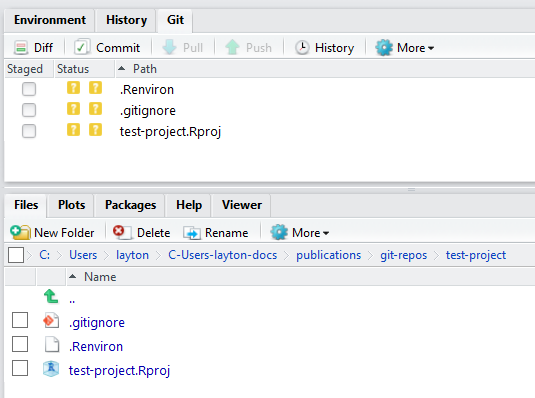

<!--
  md_document:
    variant: markdown_github
    -->
Getting started with GitHub via RStudio
=======================================

Richard Layton
2015-08-29

Update R and RStudio
====================

If you don't have R and RStudio installed, [install R](https://www.r-project.org), then [install RStudio](https://www.rstudio.com/products/rstudio/).

If you have, perhaps the first thing you should do is [update R](http://www.r-statistics.com/2015/06/a-step-by-step-screenshots-tutorial-for-upgrading-r-on-windows/) and update RStudio to the most recent versions.

You should probably update your packages too. Open RStudio. In the `Files, Plots, Packages, Help` pane, select the Packages tab -\> Update.

GitHub
======

Go to <https://github.com> and sign up for an account.

Git
===

Install Git using the appropriate method for your platform:

-   Windows or OS X: <http://git-scm.com/downloads>
-   Debian/Ubuntu: sudo apt-get install git-core
-   Fedora/RedHat: sudo yum install git-core

<!--Go to the Git program directory, find Git -> cmd -> git-gui.exe. On my Windows machine, I place a shortcut to this file on my desktop.-->
### Setting your GitHub account information

Go to the Git program directory, find Git -\> git-bash.exe. Run the file.

in the "shell" window that appears, type

`git config --global user.name your-github-user-name`

return, then type

`git config --global user.email your-github-email@somewhere`

return.

### Set the RStudio option for the Git executable file

Open RStudio.

Tools -\> Global Options -\> Git/SVN. In the dialog box for *Git executable*, write the path to the git.exe file, for example, `C:/Program Files/Git/bin/git.exe`.

Create a project directory
==========================

In any convenient directory, create a new project folder. This directory will be your local repository of materials that will appear on GitHub. The name of this directory will be also be the name of the GitHub repository.

### Make this directory a repository

Run the git-gui.exe file. In the dialog box, Select *Create a New Repository*.

Browse to the location of the project directory you just created and press the *Create* button.

You can close the Gut GUI window.

### Make this directory an R project

In RStudio, File -\> New Project -\> Existing Directory, again browse to the project folder, then Select Folder -\> Create Project.

### .Renviron file

Use File -\> New File -\> Text File to create an R environment file that will simplify R package updates. Type this one line in the file:

`R_LIBS_USER="C:/R/library"`

and Save As using the file name `.Renviron` in the top level of your project directory.

### Reality check

If all is well, the RStudio GUI should show a *Git* tab in the Environment pane. The *Files* tab should show a *.gitignore* file and an *.Rproj* file with the same name as the project directory.

README files
============

Use File -\> New File -\> R Markdown, and OK for the default settings (we'll adjust them later). Save the untitled document as `README.Rmd` at the top level of the example project directory.

Delete all the text in the Rmd file. Edit the YAML header and add one sentence as follows:

    ---
    output:
      md_document:
        variant: markdown_github
    ---

    Draft README file for GitHub. 

Save.

Press the *Knit* button.

You can close the markdown window that appears.

Knitting this Rmd file with the `markdown_github` output option produces the file *README.md*---this is the README file that we post to GitHub.

GitHub
======

Return (or login) to your GitHub account.

Select the *Repositories* tab -\> New Repository. In the New Repository box, type the same name you used for the project directory on your local machine. Then *Create Repository*.

RStudio
=======

Go to the Git tab in the Environment pane. Select the `.gitignore`, `README.md`, and the `filename.Rproj` files to commit to GitHub.

Click the *Commit* button.

In the dialog box that appears, type a commit message, e.g., "initial commit". In future commits, short and meaningful messages are useful for effective version control.

Click the *Commit* button. A message window appears. if there any any problems, read the message carefully. if everything is OK, close the window.

<!--

`git config --global user.name type-your-user-name`

`git config --global user.email type-your-email@somewhere`

-->
References
==========

1.  Christopher Gandrud (2015) *Reproducible Research with R and RStudio, 2/e*, Taylor and Francis Group LLC: Boca Raton, FL.

2.  Josh Paulson (2015, Jul) [Version control with Git and SVN](https://support.rstudio.com/hc/en-us/articles/200532077-Version-Control-with-Git-and-SVN).
